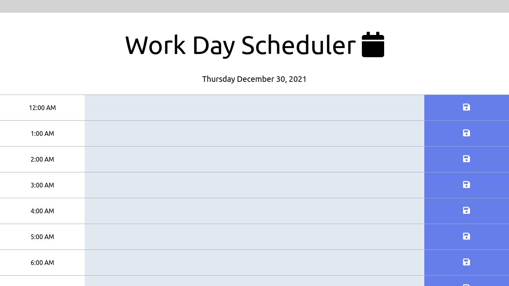

# Work Day Scheduler 

This Challenge saw me create a simple work scheduler, although it turned out to be not that simple and took me all day from me waking up to the end of the night to complete! When we enter the web page we should be able to see a whole schedule, with rows color coded to their respective times, if one was in the past, present, or future their color would change depending on this. We should also be able to save our submissions in the local storage so that when we refresh the page they are still there. 

## User Story

```
AS AN employee with a busy schedule
I WANT to add important events to a daily planner
SO THAT I can manage my time effectively
```

## Acceptance Criteria 

```
GIVEN I am using a daily planner to create a schedule
WHEN I open the planner
THEN the current day is displayed at the top of the calendar
WHEN I scroll down
THEN I am presented with time blocks for standard business hours
WHEN I view the time blocks for that day
THEN each time block is color-coded to indicate whether it is in the past, present, or future
WHEN I click into a time block
THEN I can enter an event
WHEN I click the save button for that time block
THEN the text for that event is saved in local storage
WHEN I refresh the page
THEN the saved events persist
```

## Mock Up 



## Link to Uploaded Page

https://devgomez1.github.io/daily-planner/